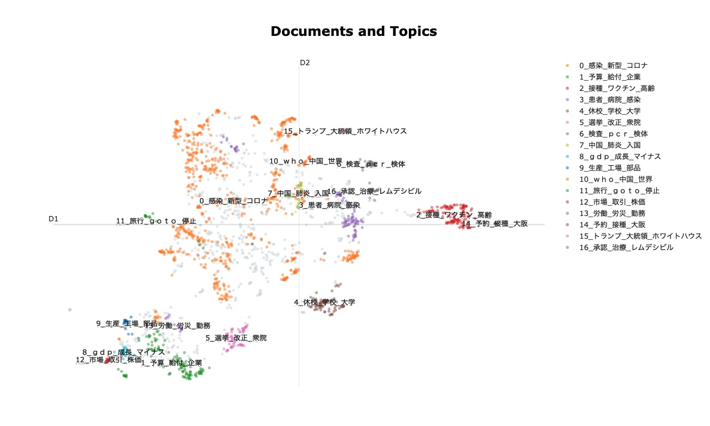
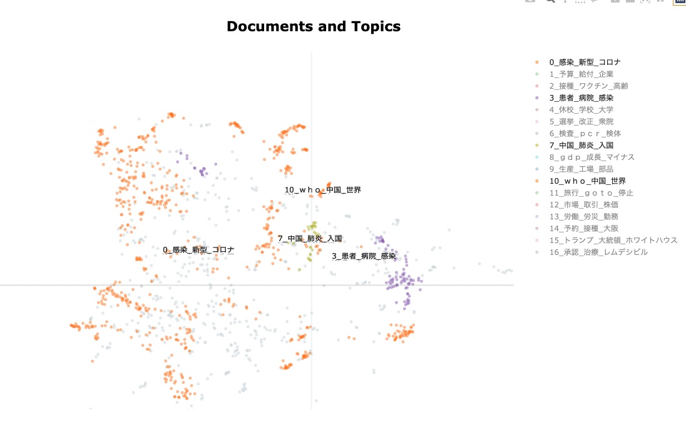
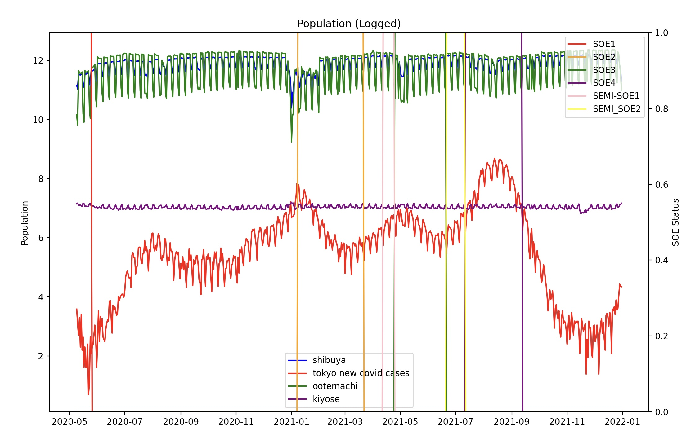
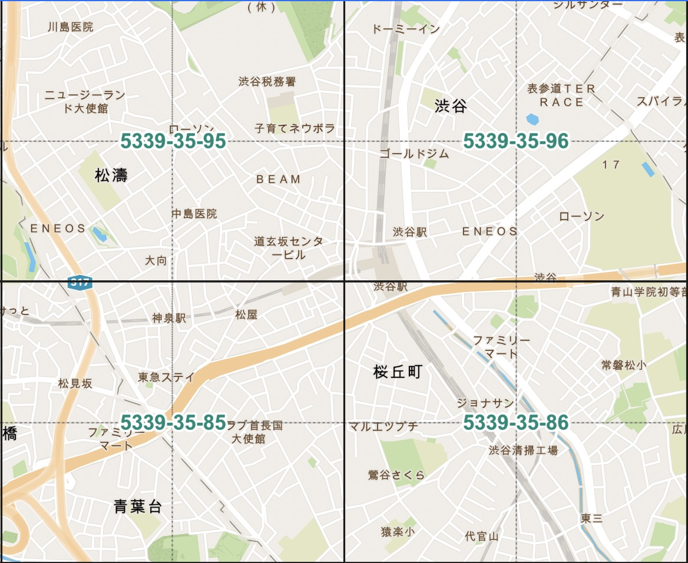
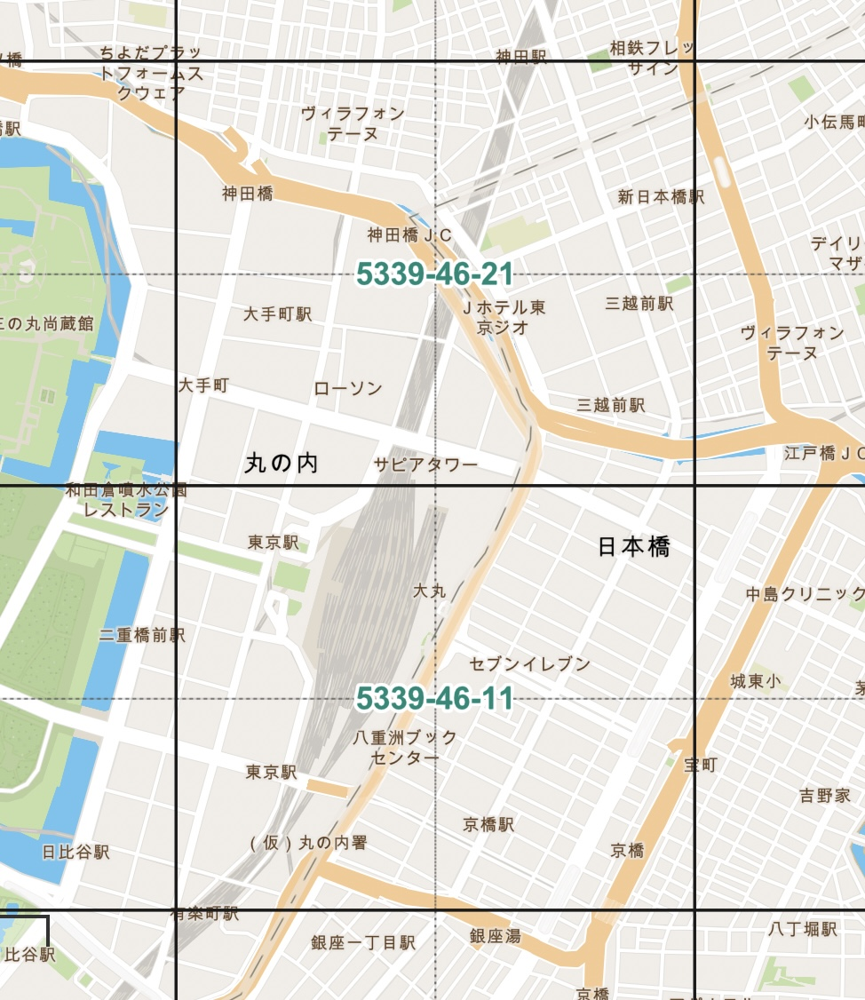
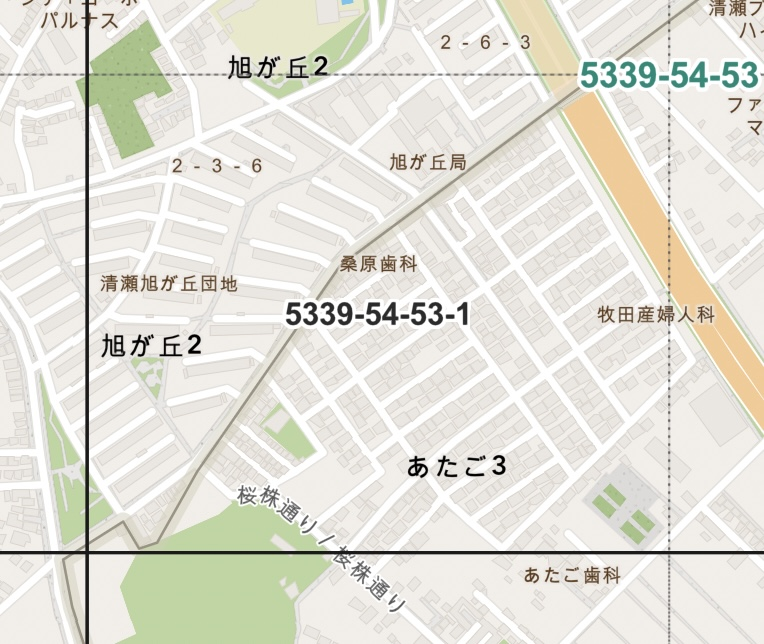

```{r setup, include=FALSE}
knitr::opts_chunk$set(warning = FALSE, echo = FALSE, message= FALSE, comment = "",
                      fig.width = 5, fig.height = 4, cache=T)
```
\newpage

# Introduction 

## Background  

The COVID-19 pandemic has had a profound impact on human mobility, as governments around the world have imposed restrictions on travel and public gatherings in an effort to slow the spread of the virus. At the same time, news reports have played a critical role in shaping public understanding of the pandemic and guiding decisions about personal behavior. This study aims to examine the relationship between news reports and human mobility during the COVID-19 pandemic, exploring the ways in which news coverage has influenced patterns of travel and mobility in communities in Japan. Through careful analysis of Japanese news publications' coverage of COVID-19 and a comprehensive examination of mobile phone location data, we hope to gain a deeper understanding of the complex interplay between news, public perception, and human behavior in times of crisis.  
    During the height of the COVID-19 pandemic, there was a pronounced decrease in human mobility as a result of restrictive measures imposed on the public to contain the spread of the virus. Governments across the globe implemented stringent guidelines and regulations aimed at limiting public gatherings and non-essential travel. Media outlets and news sources complemented these efforts by reporting the urgency of the pandemic, prompting many to heed warnings to stay at home and limit travel. This is especially so in the case of Japan, where strict restrictions on civil liberties are difficult for the government to impose due to legal complications. Unlike many Western nations, Japan did not impose strict curfews or lockdowns on its citizens to prevent infections [@jp-covid-response-jpt]. Instead, it opted for strongly worded press releases, behavioral guidelines, and recommendations for the public to willfully follow. Much of the relative success Japan has had in curbing COVID-19 infections is attributed to this 自粛 (self-restraint) exercised by the public.    
    There is hardly any denying that news and media outlets played a role in expediting such responses among the public. Even under the assumption that the public were merely forming rational responses to the risks of leaving their homes during a pandemic, they need information regarding the spread of the disease and the urgency of the situation in order to reach such decisions. This paper argues that Japanese news outlets did more than just passively relay objective information about the current spread of COVID-19 but also actively influenced  Japanese people's pandemic responses by shaping their understanding of the urgency of the situation. 

## Literature Review  

This research contributes to roughly three areas in the academic literature.    
    First, this paper contributes to the study of the relationship between media and human behavior. This research has focused on several key areas, including the effects of framing and agenda setting. The framing effect refers to how the subtle ways in which a media outlet presents an issue, or framing, can have significant impacts on people's perceptions, attitudes, and behaviors. For example, Entman [-@entman1993framing] found that different frames used by the media can influence the public's understanding of political events and can lead to different policy preferences. Another study by Nisbet and Scheufele [-@nisbet2009s] found that framing can impact people's attitudes towards health issues, such as vaccination, and can shape public opinion on social and environmental issues. Similarly, research on agenda setting has demonstrated that media play a key role in determining which issues are considered important by the public. This is because the media set the "agenda" for what is considered newsworthy and worthy of public attention. A classic study by McCombs and Shaw [-@mccombs1972agenda] found that the media's agenda can influence people's perceptions of the importance of certain issues, as well as their opinions on those issues. More recent research has further confirmed the importance of media agenda setting, with studies finding that the media's agenda can impact government policies and disaster prevention/response in the case of natural disasters [@agendaSettingKatrina].     
    Second, the paper adds to the emerging academic literature utilizing large-scale geospatial mesh data. Traditional methods for measuring human mobility include using census and tax record data, which only offer data at annual intervals and are not fit for research like ours that relies on high frequency data. Questionnaires and surveys are also common in travel demand analytics, but this type of data can face problems with high bias and questionable accuracy. Furthermore, they can be costly to acquire and difficult to process. Un-aggregated GPS probe data and call detail records (CDR) data address the issue of frequency and accuracy by providing precise, continuous data on an individual's location. However, the former is rife with computational difficulties as the data often requires complex preprocessing such as map-matching and can quickly become too large to process in a resource-constrained environment, while the latter evokes privacy concerns as it can identify private information about the cellphone owners such as their address [@VONMORNER20172233]. Anonymized geospatial mesh data circumvents the above hurdles by providing high frequency, high granularity, reliable data that by the use of Standard Grid Squares. The data aggregates mobile phone GPS data into grids (a.k.a., "meshes") based on locations of cellphone towers, and records the number of people in a given mesh at a given hour. An increasing number of new studies have used this data in ways such as to measure differences in mobility patterns of people based on socioeconomic factors [@NBERw27072], estimate evacuation patterns in the case of an earthquake [@evacuationGPS], and empirically validate theoretical spatial econometric models [@spatialMobility]. My research follows in these efforts by utilizing the accuracy and high frequency of mesh data as a robust measurement of mobility that allows for inferring impulse responses in the data.    
    Third, the use of text analytic methods in order to process and utilize text data for quantitative analysis employed in this paper are part of a bigger trend of text analytics in economics. The introduction of text analytics and sophisticated natural language processing (NLP) methods to economics has considerably expanded the scope of data available for use in economic analysis. One example of using text analytics in economic research is the use of sentiment analysis in stock market prediction. Researchers have used NLP techniques to analyze large volumes of financial news articles and social media posts to identify trends and predict stock market movements. For example, in a study by Bollen, Mao, and Zeng [-@bollen2011twitter], researchers used NLP techniques to analyze blog posts and found a significant correlation between changes in blog sentiment and stock market movements. Another example of NLP in economic research is the use of topic modeling to analyze text data in macroeconomics. Topic modeling, which is also employed in this paper, is a machine learning technique that uses NLP algorithms to identify patterns and themes in large volumes of text data. In a study by Muchnik et al. [-@muchnik2013social], researchers used topic modeling to analyze news articles and found that changes in the media's coverage of certain topics were correlated with changes in the economy.   

## Hypothesis  

The central hypothesis of this paper is thus: 
\begin{itemize}
\item[H:] News articles influence human behavior through channels other than providing objetive information to rational decision makers. Specifically, they influence human behavior via framing and agenda setting. 
\end{itemize}

The following sections test the operational form of the above hypothesis.
\begin{itemize}
\item[H':] Controlling for other factors, the \emph{urgency} of news reports on COVID-19 has a significant influence on human mobility patterns. 
\end{itemize}

# Methodology 

## Data   

### Mobility Data  

The mobile location data analyzed in this study was collected from [NTT Docomo Inc](https://www.docomo.ne.jp/english/), the largest mobile carrier in Japan. The data records the number of people in a given square grid ("mesh"), centered around a mobile base station, at a given hour. Standard Grid Squares are defined by [Japan's Statistics Bureau](https://www.stat.go.jp/english/data/mesh/05.html}) and shown in the table below. It counts one user residing within the grid for 15 minutes as 0.25 people, and aggregates the number of NTT mobile carriers according to that formula. One notable feature about mesh data is that since it relies on phones' connections to base stations to derive its records, it can even measure the location of users who do not have GPS enabled or are not currently using the GPS probing service. Thus, it provides a less biased and more accurate alternative to GPS probe data. At the time this mesh data was collected, NTT Docomo Inc had over 80 million users.  

| Partition | Interval of Latitude | Interval of Longitude | Length of Side |  
| -------- | --------------------- | --------------------- | -------------- |  
|Primary Area Partition | 40 minutes | 1 degree | about 80 km |  
| Secondary Area Partition | 5 minutes | 7 minutes 30 seconds | about 10 km | 
| Basic Grid Square |30 seconds | 45 seconds  | about 1 km | 
| Half Grid Square |   15 seconds | 22.5 seconds | about 500 m |


    The grids selected in this study are described in the table below. The choice of the grids depends on the characteristics of the location. The first grid extracts areas around Shibuya station, a busy hub of entertainment and leisure facilities. The second grid extracts areas in and around Ootemachi station, a major business hub. The third grid is the smallest of all of them and is located in the remote suburbs of Tokyo, in a city called Kiyose. This grid was selected for being a primarily residential area (a bed town) containing residences and a housing complex, and for being the author's home. The grid representation of each area is included in the appendix as Figures \@ref(fig:shibuyamesh), \@ref(fig:ootemachimesh), \@ref(fig:kiyosemesh).  

| Name | Basic Grid | Half Grid | Area | Description | 
| ------------ |  ----------------- | ---------------- | ----------- | ------- |  
| Shibuya |  5339-35-95, 5339-35-96, 5339-35-85, 5339-35-86 | | 4 $\text{km}^2$ |Leisure |   
| Ootemachi | 5339-46-11, 5339-46-21 | | 2$\text{km}^2$ | Business | 
| Kiyose | | 5339-54-53-1 | 0.25 $\text{km}^2$ | Residential |   
    This paper uses population data of the above grids from 2020-01-01 to 2021-12-31 to focus on population responses to news reports on the pandemic. The population data is aggregated over the grids so that each location (Shibuya, Ootemachi, Kiyose) has one population parameter (the sum of population in each grid contained in the area). Further, instead of dealing with hourly population information, the data is divided into 3 time bins: Daytime (8:00-17:00, or work hours), Evening (17:00-24:00), and Night (24:00-8:00). For this study, Daytime population was used.  After binning the data, population is averaged across hours within the Daytime hours per area per day. This way, we end up with the mean daytime population of each area per day. The resultant data set is shown in Table \@ref(tab:table3), as well as descriptive statistics of the data in Table \@ref(tab:table4) and a plot of the logged population per area in Figure \@ref(fig:figure1).  

```{r table3, label="table3", fig.width=5, fig.pos = "H", out.extra = ""}
library(knitr)

shibs_df <- read.csv("../data/ntt_data/shibuya_station_1_refined_binned.csv")
shibs_df["area"] <- "Shibuya"
shibs_df <- shibs_df[c("date", "area", "population", "time_bin")]
df <- head(shibs_df)

kable(df, caption = "Population data")
```

```{r table4, label="table4"}
library(dplyr)
library(kableExtra)
ootemachi <- read.csv("../data/ntt_data/tokyo_ootemachi_refined_binned.csv")
kiyose <- read.csv("../data/ntt_data/kiyose_jutakugai_refined_binned.csv")

shibs_daytime <- shibs_df[shibs_df["time_bin"] == "800-1700", ]
kiyose_daytime <- kiyose[kiyose["time_bin"] == "800-1700", ]
ootemachi_daytime <- ootemachi[ootemachi["time_bin"] == "800-1700", ]
df <- data.frame(matrix(nrow = nrow(shibs_daytime), ncol = 0))
df$shibuya <- shibs_daytime$population
df$ootemachi <- ootemachi_daytime$population
df$kiyose <- kiyose_daytime$population

as.data.frame(apply(df,2,summary)) %>% 
  kbl(caption = "Descriptive Statistics of Daytime Population Data") %>% 
  kable_styling()
```
```{r figure1, label="figure1", fig.align='center', fig.width=10, fig.cap="Log Population per Area"}
df$date <- shibs_daytime$date
df$date <- as.Date(df$date, "%Y-%m-%d")
library(ggplot2)
# Plot the data
ggplot(df, aes(x = date)) +
  geom_line(aes(y = log(shibuya), color = "shibuya")) +
  geom_line(aes(y = log(ootemachi), color = "ootemachi")) +
  geom_line(aes(y = log(kiyose), color = "kiyose")) +
  theme_bw() +
  scale_color_manual(values = c("shibuya" = "red", "ootemachi" = "blue", "kiyose" = "orange")) +
  labs(x = "Date", y = "Logged Population", color = "Area")
write.csv(df, file="../data/ntt_data/daytime_agg.csv", row.names=F)
```
    Looking at Figure 1, we can see that Shibuya and Ootemachi are for the most part positively correlated, while Kiyose seems to be inversely correlated with the two. This can be explained as the direct result of Kiyose being a bed town: when the population at business and leisure hubs is high, bed town population is low, and vice-versa. The sudden dips and hills in the data correspond to COVID-19 waves and state of emergencies, as we will see later. 

### News Urgency Data   

The data for news urgency was created using a three step process. First, the author crawled the internet for COVID-19 related articles released by major Japanese news publications between January 1st, 2020 and December 31st, 2021. Then, a topic model was applied to analyze and separate the crawled text data into topics, and filtered the data to preserve only articles reporting on the *domestic spread of COVID-19*. Finally, the remaining articles were used to compute a score for each day, signifying the overall urgency in the overall voice of the news articles released that morning.  
    The online databases of the following major Japnaese news publications were crawled: Mainichi Shinbun (毎日新聞), Asahi Shinbun (朝日新聞), Nikkei Shinbun (日経新聞), and Yomiuri Shinbun (読売新聞). The author designed a web crawler for each database and finetuned search parameters for each publication that were yielding the results most relevant to my use case. Below is a summary of the parameters per publication.   

| Name | Database Link | Search Words | Other constraints | Num Articles Retrieved |  
| ---- | ------------- | ------------ | ----------------- | ---------------------- |   
| 毎日 | [毎索](https://dbs-g-search-or-jp.waseda.idm.oclc.org/WMAI/WMAI_ipcu_login.html) | 新型コロナ OR 新型肺炎 OR コロナ OR COVID  OR  (武漢 AND 肺炎) | National, Morning Paper, Front Page | 939 |
| 朝日 | [朝日新聞クロスサーチ](https://xsearch-asahi-com.waseda.idm.oclc.org/kiji/) | 新型コロナ OR 新型肺炎 OR コロナ OR COVID  OR  (武漢 AND 肺炎) | National, Morning Paper, Front Page | 519 |  
| 日経 |  [日経テレコン](https://t21-nikkei-co-jp.waseda.idm.oclc.org/g3/CMNDF11.do) | [一般用語:新型] AND [一般用語:感染] | National, Morning Paper, Front Page | 261 |  
| 読売 | [ヨミダス歴史館](https://database-yomiuri-co-jp.waseda.idm.oclc.org/rekishikan/) | 新型コロナ AND 国内 AND 感染 | National, Morning Paper, Front Page | 308 |  

    The articles obtained were filtered to those that appeared on the front page of each publication's morning print of their national newspaper. This is to collect the articles with the most influence. For their to be a relationship between a news article and a person's behavior, that person needs to have read the article in question. By taking articles on the morning news front page, we can extract those with the most exposure and most readers. Although this analysis only looks at articles from these 4 publications, it is reasonable to assume that much of overall media coverage regarding COVID-19 will be highly correlated with the reporting of these 4 largest newspaper companies in Japan.   
    The next step was to apply topic modeling to filter out irrelevant topics and keep only the topics reporting the state of COVID-19 infections in Japan. For this, the BERTopic algorithm and its python implementation from the package `bertopic` was used. BERTopic is an algorithm for creating topic representations from a set of documents. The algorithm consists of five main steps: 1) Extract embeddings from documents using a sentence-transformer model, 2) Reduce dimensionality of the embeddings using UMAP, 3) Cluster the reduced embeddings using HDBSCAN, 4) Convert each cluster into a single document and represent as a bag-of-words, 5) Create the topic representation using class-based TF-IDF [@bertopic]. Class-based TF-IDF is identical to traditional TF-IDF save one detail: instead of extracting the most important words per document, it is extracting the most important words per class, or cluster.   
    In the implementation, the morphological analysis tool MECAB was first applied to parse the Japanese texts and to filter out meaningless noise that could corrupt the results of the topic modeling. Then, the filtered and cleaned text data was passed into BERTopic for modeling. The model interpretability and exclusivity both saw significant improvement after tagged and filtered by MECAB.    
    Figure \@ref(fig:bertopic)shows the documents clustered by topic and projected onto a 2 dimensional space. We can see that the algorithm does a fairly good job of grouping the articles into distinct categories. Studying the lab on the right shows that many of the articles scraped from the databases talk about economics under covid, such as topics 1, 8, 9, 12; vaccinations, such as 2, 14; school, labor, and politics, such as 4, 5, 11, 13, 15, and PCR testing, COVID-19 medication, or 6, 16. Filtering these topics out, we get Figure \@ref(fig:bertopic2).  

```{r bertopic, echo=F, out.width="100%", label='bertopic', fig.cap="Topics of covid news reports, grouped"}

```
```{r bertopic2, echo=F, out.width="100%", label='bertopic2', fig.cap="Topics of covid news reports, filtered"}

```
    To convert the above into scores based on the perceived urgency of the article, a random sample of 30\% of the original data was extracted, manually labeled, and used to train a supervised Support Vector Machine. However, constraints on the sample size, which had shrunk to 556 after filtering irrelevant topics, provided a considerable hurdle in achieving a highly performant model, and the predictions from the SVM were infeasible to use.     
    Therefore, instead of scoring based on human labeling and predictions, the study uses the *number of unique publications reporting front page news on COVID-19 transmissions per day* as a proxy for urgency in news reports of COVID-19 for that day. The reasoning behind this is simple. The more consensus there is between varying publications on the importance of COVID-19, the stronger the sense of urgency felt by the public. From an agenda setting point of view, the more publications are reporting on a similar topic, the more important the topic becomes in the eyes of the people. Thus, the urgency score takes a discrete value from 0 to 4, a higher value indicating a higher level of urgency in media reports. Taking a look at 5 randomly sampled news article titles with urgency score of 4 in Table \@ref(tab:randomurgency4) and 5 random samples with urgency score of 1 in Table \@ref(tab:randomurgency1), we see that the article titles with scores of 4 make use of loaded words such as "国内，超え，緊急”, whereas the titles with scores of 1 report on low urgency issues related to COVID-19.

```{r randomurgency4}
news <- read.csv("../data/news/articles_filtered_by_phrases.csv")
news$urgency <- news$unique_publications_reporting
colnames(news)[colnames(news) == "num_publications_reporting"] <- "urgency"
df <- news[news$urgency == 4, ][c("date", "publication", "title", "urgency")]
kable(df[sample(nrow(df), 5), ], caption = "Randomly selected articles with urgency score 4")
```
```{r randomurgency1}
news <- read.csv("../data/news/articles_filtered_by_phrases.csv")
news$urgency <- news$unique_publications_reporting
colnames(news)[colnames(news) == "num_publications_reporting"] <- "urgency"
df1 <- news[c(517, 114, 222, 285, 404), ][c("date", "publication", "title", "urgency")]
#df1 <- news[news$urgency == 1, ][c("date", "publication", "title", "urgency")]
kable(df1[sample(nrow(df1), 5), ], caption = "Randomly selected articles with urgency score 1")
```
\newpage
### Controls  

Control variable data were crawled from the following sources: 

* Covid related statistics: [Tokyo Metropolitan Government COVID-19 Information Website](https://stopcovid19.metro.tokyo.lg.jp/)  
* Weather variables: [Japan Meteorological Agency](https://www.data.jma.go.jp/gmd/risk/obsdl/index.php)

A graph of the number of new COVID-19 cases in Tokyo together with each area's population is provided in [Figure 4](#chunk-figure4). 

```{r figure4, echo=F, out.width="100%", label='figure4', fig.cap="Log population and COVID"}

```

## Model  

The aim is to understand the marginal effect of an increase in urgency in news reporting COVID-19 on *changes in people's mobility patterns*. Therefore, denoting population at area $r$, time $t$ as $p_{rt}$, urgency score of news at time $t$ as $u_t$, the dependent variable of interest is $\log \left(\frac{p_{rt}}{p_{r, t-1}}\right)$, and the marginal effect of $u_t$ on that can be expressed as 
$$\frac{\partial \log \left(\frac{p_{rt}}{p_{r, t-1}}\right)}{\partial u_t} = \frac{\partial(\log p_{rt} - \log p_{r, t-1})}{\partial u_t}$$  
    The reason for using the difference in the logged population from the day before as the dependent variable is because population has high autocorrelation. Accordingly, an autoregressive model is used for estimation, but such models demand that the autocorrelating variable satisfies stationarity. The table below shows results of an Augmented Dickey Fuller Test on logged population and the difference in the logged population from the day before  for each area. The null is never rejected when testing logged population, but always rejected when testing the difference in the logged population from the day before. Therefore, it is reasonable to assume the difference in logged population is stationary, and thus appropriate to use for an autoregressive model. 

| Area | Variable | ADF Test Statistic | ADF p-value |  
| ---- | -------- | ------------------ | ----------- |  
| Shibuya | $\;\;$$\;\;$$\log p_t$ | -2.56 | 0.10 |  
| Shibuya | $\;\;$$\;\;$$\log \left(\frac{p_{t}}{p_{t-1}}\right)$ | -6.1 | 0.00* |  
| Ootemachi |$\;\;$$\;\;$$\log p_t$ | -2.66 | 0.08 |  
| Ootemachi | $\;\;$$\;\;$$\log \left(\frac{p_{t}}{p_{t-1}}\right)$ | -7.85 | 0.00* |  
| Kiyose | $\;\;$$\;\;$$\log p_t$ | -2.54  | 0.11 |  
| Kiyose | $\;\;$$\;\;$$\log \left(\frac{p_{t}}{p_{t-1}}\right)$ | -8.12 | 0.00* |   

    Because the model assumes complete exogeneity of the news urgency scores on mobility, it can treat them as impulse shocks and estimate them via local projection with reliable accuracy [@jorda2005estimation]. This can be done with a simple linear model:

$$\log \left(\frac{p_{rt}}{p_{r, t-1}}\right) = \alpha + \beta u_{t} + \gamma \log \left(\frac{p_{r, t-1}}{p_{r, t-2}}\right) + \psi x_t + e_t$$
where $\alpha$ is a constant, $u_t$ is the urgency score for the morning news on day $t$, $\log \left(\frac{p_{r, t-1}}{p_{r, t-2}}\right)$ a lag of the dependent variable, $x_t$ a vector of controls, and $e_t$ the error term. The controls include a 1-day lag for new COVID cases in Tokyo (because cases are not announced until the end of the day), a 1-week lag for new COVID cases in Tokyo, and dummies for weather, day of the week, holidays, states of emergency, semi states of emergency (まん延防止等重点措置), and COVID waves.  

## Assumptions  

The model makes a few critical assumptions.   
    First, the model assumes that the urgency scores for the news reports are valid and accurately reflect the urgency in the voice of overall reports on COVID-19 released in that day. Although the sample of COVID-19 reports used to compute such scores is limited to just four newspaper publications, the reasons laid out in [2.1.2](#news-urgency-data) justify this assumption.  
    Second, the urgency scores of news reports *must be exogenous* to the population. The local projection method above is only suitable for measuring exogenous impulse shocks, and the results rely on the presumption that news urgency is not affected by changes in mobility.   
    Theoretically, it is possible for mobility to affect news urgency. An increase in outings in densely populated areas could contribute to rising numbers of COVID-19 cases, which in turn could raise urgency in COVID-19 news reports. However, because the study only examines the population in small grids at a time, it is likely that mobility changes in these limited areas do not have an effect on overall urgency of news reports. This issue will be revisited during robustness checks in [3.2](#robustness-checks). 


# Results

## Results  

The results of regressing the above model are show in Table \@ref(reg1). Insignificant dummies have been removed from the table for better readability. The population changes in all three areas selected show a significant correlation with urgency scores. Furthermore, we see that Shibuya and Ootemachi have a negative correlation, signifying a reduction in population change from the day before when urgency of news reporting is high. Kiyose, on the other hand, shows a positive correlation with urgency. The polarity of the coefficients stays consistent across variables, weekday variables, weather variables, etc. all affecting Kiyose in the opposite direction as the other two. This reveals its characteristics as a residential bed town. Interestingly, the business hub of Ootemachi seems to be more sensitive to changes in `news_urgency` than the leisure hub of Shibuya.   
    Since we are taking a log transform of $\frac{p_{rt}}{p_{r, t-1}}$ as our dependent variable, the interpretation of the coefficients $\beta$ on `news_urgency` becomes the following: holding other variables fixed, a one score increase in `news_urgency` will drive up $\frac{p_{rt}}{p_{r, t-1}}$ by $100\beta\%$. In Shibuya, an increase in the level of urgency would result in a 1.4\% decrease in the ratio of today's population to yesterday's population, while in Ootemachi it would be a 2.7\% decrease and in Kiyose a 0.3\% increase. For better interpretability, the same regression using $p_{rt} - p_{r, t-1}$ as the dependent variable was evaluated with similar results. The regression results are found in the Appendix at Table \@ref(reg2).  
    It is interesting to note that the number of new COVID-19 cases in Tokyo have little to no effect on population change. The paper discussed that a large part of the influence of media on human behavior comes from acting as a channel delivering objective information that people then use to formulate their rational responses to. Conversely, what we see here seems to suggest that the agenda setting and subtle framing by the media are more significant factors in influencing consumers of media, providing stronger results than what the hypothesis predicted. The natural, McLuhanian conclusion to this would be that it is not the facts behind the story, but how the story is *presented* which influences people's actions. 

\begin{table}[!htbp] \centering
\scalebox{0.7}{
\begin{tabular}{@{\extracolsep{5pt}}lccc}
\\[-1.8ex]\hline
\hline \\[-1.8ex]
& \multicolumn{3}{c}{\textit{Dependent variable:} population\_log\_diff} \
\cr \cline{3-4}
\\[-1.8ex] & Shibuya & Ootemachi & Kiyose \\
\hline \\[-1.8ex]
 const & 0.023$^{}$ & 0.061$^{}$ & -0.018$^{*}$ \\
  & (0.031) & (0.080) & (0.010) \\
 news\_urgency & -0.014$^{***}$ & -0.027$^{**}$ & 0.003$^{***}$ \\
  & (0.004) & (0.011) & (0.001) \\
 population\_log\_diff\_lag & -0.326$^{***}$ & -0.415$^{***}$ & -0.406$^{***}$ \\
  & (0.031) & (0.029) & (0.031) \\
 holiday & -0.300$^{***}$ & -0.951$^{***}$ & 0.080$^{***}$ \\
  & (0.018) & (0.046) & (0.005) \\
 tokyo\_new\_cases\_lag & -0.000$^{}$ & -0.000$^{}$ & 0.000$^{}$ \\
  & (0.000) & (0.000) & (0.000) \\
 tokyo\_new\_cases\_week\_lag & 0.000$^{}$ & 0.000$^{}$ & -0.000$^{}$ \\
  & (0.000) & (0.000) & (0.000) \\
 rain & -0.003$^{}$ & 0.016$^{}$ & 0.014$^{***}$ \\
  & (0.010) & (0.027) & (0.005) \\
 thunder & 0.000$^{***}$ & -0.000$^{}$ & 0.000$^{***}$ \\
  & (0.000) & (0.000) & (0.000) \\
 sunny & 0.021$^{**}$ & 0.055$^{**}$ & 0.006$^{}$\\
  & (0.010) & (0.025) & (0.005)\\
 cloudy & 0.000$^{}$ & -0.003$^{}$ &  0.010$^{**}$\\
  & (0.008) & (0.022) & (0.005)\\
 fog & -0.000$^{***}$ & 0.000$^{***}$ & 0.000$^{***}$\\
  & (0.000) & (0.000) & (0.000)\\
 Monday & 0.359$^{***}$ & 1.201$^{***}$ & -0.108$^{***}$ \\
  & (0.010) & (0.027) & (0.003) \\
 Tuesday & 0.141$^{***}$ & 0.558$^{***}$ & -0.050$^{***}$ \\
  & (0.015) & (0.044) & (0.005) \\
 Saturday & -0.293$^{***}$ & -1.069$^{***}$ & 0.087$^{***}$ \\
  & (0.010) & (0.026) & (0.003) \\
 Sunday & -0.197$^{***}$ & -0.660$^{***}$ & 0.068$^{***}$ \\
  & (0.013) & (0.040) & (0.004) \\
\hline \\[-1.8ex]
 Observations & 709 & 709 & 709 \\
 $R^2$ & 0.814 & 0.879 & 0.832 \\
 Adjusted $R^2$ & 0.807 & 0.874 & 0.825 \\
 Residual Std. Error & 0.095(df = 682) & 0.250(df = 682) & 0.028(df = 681)  \\
 F Statistic & 114.582$^{***}$ (df = 26.0; 682.0) & 190.144$^{***}$ (df = 26.0; 682.0) & 124.747$^{***}$ (df = 27.0; 681.0) \\
\hline
\hline \\[-1.8ex]
\textit{Note:} & \multicolumn{3}{r}{$^{*}$p$<$0.1; $^{**}$p$<$0.05; $^{***}$p$<$0.01}\\
\end{tabular}}
\caption{\label{reg1}OLS Regression Results With Logged Population Difference}
\end{table}

\newpage 

## Robustness checks  

As mentioned in [3.2](#assumptions), the validity of the model rests on the assumption that news urgency is exogenous to the population. If, for example, there is a reverse correlation and the population of time $t-1$ is influencing the news urgency of time $t$, the model is misspecified and the impulse responses obtained are unreliable. To test this, a placebo test is conducted by regressing `news_urgency` at time $t$ on the population change at time $t-1$, with the usual controls. In other words, we are testing for a relationship of the urgency of news articles from *today* with the mobility patterns of *yesterday*. If there is endogeneity in the model, the placebo should reveal a significant correlation between the two. The results obtained are shown in Table \@ref(placebo), hiding the controls. For all three regions, significance of `news_urgency` disappears in the placebo. Although this is not a perfect test of endogeneity, it reinforces the probability that `news_urgency` is indeed exogenous and the model used is correctly specified. 

\begin{table}[!htbp] \centering
\scalebox{0.7}{
\begin{tabular}{@{\extracolsep{5pt}}lccc}
\\[-1.8ex]\hline
\hline \\[-1.8ex]
& \multicolumn{3}{c}{\textit{Dependent variable:} population\_log\_diff} \
\cr \cline{3-4}
\\[-1.8ex] & Shibuya & Ootemachi & Kiyose \\
\hline \\[-1.8ex]
 const & -0.011$^{}$ & 0.040$^{}$ & -0.014$^{}$ \\
  & (0.030) & (0.080) & (0.010) \\
 news\_urgency & 0.002$^{}$ & -0.017$^{}$ & 0.001$^{}$ \\
  & (0.004) & (0.011) & (0.001) \\
 population\_log\_diff\_lag & -0.339$^{***}$ & -0.415$^{***}$ & -0.408$^{***}$ \\
  & (0.031) & (0.029) & (0.031) \\
\hline \\[-1.8ex]
 Observations & 707 & 707 & 707 \\
 $R^2$ & 0.123 & 0.123 & 0.123 \\
 Adjusted $R^2$ & 0.090 & 0.090 & 0.090 \\
 Residual Std. Error & 0.043(df = 680) & 0.043(df = 680) & 0.043(df = 680)  \\
 F Statistic & 3.680$^{***}$ (df = 26.0; 680.0) & 3.680$^{***}$ (df = 26.0; 680.0) & 3.680$^{***}$ (df = 26.0; 680.0) \\
\hline
\hline \\[-1.8ex]
\textit{Note:} & \multicolumn{3}{r}{$^{*}$p$<$0.1; $^{**}$p$<$0.05; $^{***}$p$<$0.01} \\
\end{tabular}}
\caption{\label{placebo}Placebo Test for Endogeneity}
\end{table}


# Conclusion

## Summary of Findings   

The study found a significant correlation between the population changes in three selected areas (Shibuya, Ootemachi, and Kiyose) and the urgency scores of news reporting. The results showed that Shibuya and Ootemachi have a negative correlation with urgency, indicating a decrease in population change with higher urgency, while Kiyose has a positive correlation, indicating an increase in population change with higher urgency. The regression results are consistent with the operational hypothesis of this study, namely, that urgency of news reporting COVID has significant impact on human mobility patterns. The impact on human mobility patterns were as predicted given the characteristics of each area. In leisure and business hubs, the population goes down, while in residential areas, the population goes up in response to increased urgency, suggesting that people are choosing to stay in their homes in response to the urgency of news reports. The study also found that the number of COVID-19 cases had little to no effect on population change, suggesting that framing and agenda setting are more significant factors in influencing behavior than communicating objective information. The findings support the central hypothesis, at the very least in the case of public crises.  

## Policy Implications   

The results imply that the way news is reported and presented can have a significant impact on human behavior, particularly in times of crisis and natural disasters. This suggests that the media has a significant role to play in shaping public perception and behavior, and that care should be taken to present information in a responsible and impartial manner. Policymakers may consider the influence of media in their crisis response and disaster management plans, and work with media outlets to ensure accurate and balanced reporting. To this end, this study finds that the Japanese response to COVID-19 was overall an effective strategy, and provides an alternative model of pandemic response to enforced lockdowns and strict legal regulation. Additionally, media literacy campaigns may be useful in educating the public on how to critically analyze news and make informed decisions. 

## Limitations and Future Research  

This study is limited by a variety of factors.   
    First, the validity of the urgency scores used in this study are difficult to verify. Due to the lack of APIs for the Japanese newspaper databases crawled, the author had to code a custom webcrawler for each database. The query logic and search conditions for each database varied widely, resulting in different search terms per database, and producing varying numbers of articles from each. This may have complicated the topic modeling process and produced topics with questionable reliability. Furthermore, the use of a proxy instead of a properly trained SVM to classify urgency scores means that the 'urgency' in the articles represented by the proxy urgency scores may not directly take into account the voice, reporting techniques, and other textual characteristics. Incorporating such characteristics would result in a richer, more precise analysis. It is also possible the implicit assumption that most media publications in Japan correlate with the reports of the four major newspaper publications selected in this study is not true, in which case the correlation found could be spurious.  
    Second, there is always the possibility of endogeneity. Shibuya and Ootemachi especially are major, densely populated hubs of Tokyo. Mobility patterns in these areas could potentially shape narratives in news reports. More robust statistical techniques along with methods for causal inference could provide a clearer, more robust picture of the true relationship between media and human behavior. 
    Finally, the study is limited to the setting of COVID-19. It is unclear how generalizable the results obtained in this article are to other situations, especially considering how unique a phenomenon COVID-19 was.   
    Even with its shortcomings, this study lays out a promising path for robustly inferring the effect of media without relying on self reported surveys or qualitative speculation. The techniques used in this paper, such as text analytics and the employment of mesh geospatial data, circumvent many of the hurdles that exist in previous research. With rapidly advancing NLP techniques, future research is soon to offer even more insight into the operations of language and text in our society. The author hopes that this study serves as an early step in that direction.  

# References

<div id="refs"></div>


# Appendix

```{r shibuyamesh, echo=F, out.width="100%", label='shibuyamesh', fig.cap="Shibuya station in grids. Source: https://www.arcgis.com/"}

```
```{r ootemachimesh, echo=F, out.width="100%", label='ootemachimesh', fig.cap="Ootemachi station in grids. Source: https://www.arcgis.com/"}

```
```{r kiyosemesh, echo=F, out.width="100%", label='kiyosemesh', fig.cap="Kiyose Danchi in grids. Source: https://www.arcgis.com/"}

```

\begin{table}[!htbp] \centering
\scalebox{0.7}{
\begin{tabular}{@{\extracolsep{5pt}}lccc}
\\[-1.8ex]\hline
\hline \\[-1.8ex]
& \multicolumn{3}{c}{\textit{Dependent variable:} population\_diff} \
\cr \cline{3-4}
\\[-1.8ex] & Shibuya & Ootemachi & Kiyose \\
\hline \\[-1.8ex]
 const & 2200.709$^{}$ & 7705.087$^{}$ & -21.272$^{*}$ \\
  & (3766.797) & (9403.313) & (11.142) \\
 holiday & -39661.799$^{***}$ & -100526.116$^{***}$ & 92.334$^{***}$ \\
  & (2155.333) & (5379.453) & (5.750) \\
 news\_urgency & -1796.105$^{***}$ & -3678.624$^{***}$ & 3.534$^{**}$ \\
  & (518.753) & (1295.043) & (1.385) \\
 population\_diff\_lag & -0.356$^{***}$ & -0.389$^{***}$ & -0.410$^{***}$ \\
  & (0.030) & (0.030) & (0.030) \\
 tokyo\_new\_cases\_lag & -0.385$^{}$ & 0.328$^{}$ & 0.002$^{}$ \\
  & (1.363) & (3.399) & (0.004) \\
 tokyo\_new\_cases\_week\_lag & 0.889$^{}$ & 1.117$^{}$ & -0.001$^{}$ \\
  & (1.272) & (3.174) & (0.003) \\
 rain & -723.938$^{}$ & 1801.375$^{}$ & 16.811$^{***}$\\
  & (1266.545) & (3162.384) & (5.709)\\
 thunder & 0.000$^{}$ & 0.000$^{**}$ & 0.000$^{}$\\
  & (0.000) & (0.000) & (0.000)\\
 sunny & 2496.283$^{**}$ & 5261.188$^{*}$ & 7.110$^{}$\\
  & (1191.343) & (2973.483) & (5.543) \\
 cloudy & -177.081$^{}$ & -152.957$^{}$ & 12.441$^{**}$\\
  & (1041.170) & (2599.164) & (5.351)\\
 Monday & 48796.115$^{***}$ & 134468.025$^{***}$ & -124.174$^{***}$ \\
  & (1274.105) & (3073.324) & (3.589) \\
 Tuesday & 20483.425$^{***}$ & 56004.488$^{***}$ & -59.095$^{***}$ \\
  & (1963.998) & (5020.124) & (5.176) \\
 Saturday & -42356.530$^{***}$ & -125039.110$^{***}$ & 99.618$^{***}$ \\
  & (1216.974) & (3037.951) & (3.332) \\
 Sunday & -27171.984$^{***}$ & -60530.804$^{***}$ & 80.296$^{***}$ \\
  & (1755.661) & (4757.422) & (4.663) \\
\hline \\[-1.8ex]
 Observations & 709 & 709 & 709 \\
 $R^2$ & 0.846 & 0.865 & 0.838 \\
 Adjusted $R^2$ & 0.840 & 0.860 & 0.832 \\
 Residual Std. Error & 11751.198(df = 682) & 29334.604(df = 682) & 31.390(df = 681)  \\
 F Statistic & 143.747$^{***}$ (df = 26.0; 682.0) & 168.403$^{***}$ (df = 26.0; 682.0) & 130.619$^{***}$ (df = 27.0; 681.0) \\
\hline
\hline \\[-1.8ex]
\textit{Note:} & \multicolumn{3}{r}{$^{*}$p$<$0.1; $^{**}$p$<$0.05; $^{***}$p$<$0.01} \\
\end{tabular}}
\caption{\label{reg2}OLS Regression Results With Unlogged Population Difference}
\end{table}

